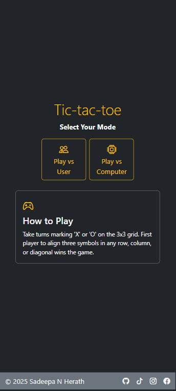
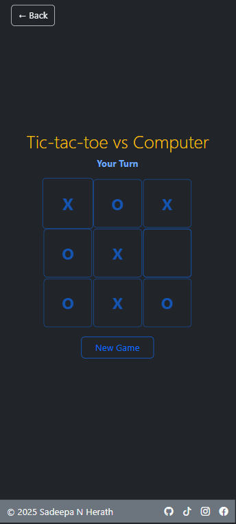

# Tic-Tac-Toe Game

A modern, responsive web-based implementation of the classic Tic-Tac-Toe game with multiple play modes.

 


## Features

- **Multiple Game Modes**
  - Play against another person
  - Play against computer AI with smart move detection
  
- **Responsive Design**
  - Optimized for mobile and desktop
  - Adjusts to different screen sizes and orientations
  
- **Interactive UI**
  - Animated transitions and effects
  - Clear game status indicators
  - Winning patterns highlighted

- **Smart Computer AI**
  - Attempts to win when possible
  - Blocks player's winning moves
  - Strategic position selection

## How to Play

1. Visit the landing page and select a game mode:
   - "Play vs User" - Play against another person
   - "Play vs Computer" - Play against computer AI

2. Game Rules:
   - Players take turns marking X or O on the 3×3 grid
   - First player to align three of their symbols horizontally, vertically, or diagonally wins
   - If all cells are filled without a winner, the game ends in a draw

3. Controls:
   - Click on an empty cell to place your mark
   - Use the "New Game" button to restart at any time

## Technologies Used

- HTML5
- CSS3
- JavaScript (vanilla)
- Bootstrap 5.3.3
- Bootstrap Icons 1.11.3

## Installation

1. Clone the repository:
   ```
   git clone https://github.com/SadeepaNHerath/Tic-Tac-Toe.git
   ```

2. Open `index.html` in any modern web browser.

No build process or dependencies required!

## Project Structure

- `index.html` - Landing page with game mode selection
- `vsPerson.html` - Player vs. player game interface
- `vsComputer.html` - Player vs. computer game interface
- `vsPersonApp.js` - Logic for player vs. player mode
- `vsComputerApp.js` - Logic for player vs. computer mode with AI
- `style.css` - Styling for the entire application
- `img/` - Contains image assets

## Author

Developed by Sadeepa N Herath

### Connect with me:
- [GitHub](https://github.com/SadeepaNHerath)
- [TikTok](https://www.tiktok.com/@sadeepanherath)
- [Instagram](https://www.instagram.com/sadeepa_herath_18)
- [Facebook](https://www.facebook.com/SadeepaNHerath)

## License

© 2025 Sadeepa N Herath. All rights reserved.
